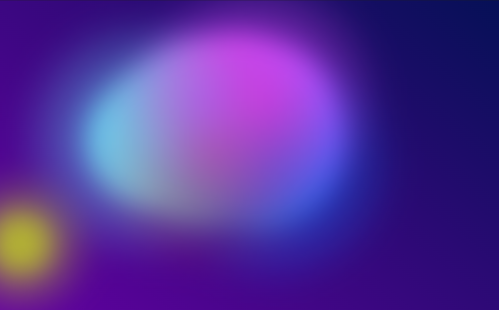

# Animated Gooey Background

An animated background where circles blend together like goo when they are close. Built using HTML, CSS, JavaScript, and SVG.
  

## 🌟 Features

- Smooth, interactive animation

- Gooey blending effect using SVG filters

- Lightweight and responsive design

- Customizable colors and blend modes

## 🚀 Demo

[Live Preview](https://arbaz93.github.io/BG-Blend-Animation/)

## 🛠️ Technologies Used

- HTML for structure

- CSS for styling

- JavaScript for intractivity

- SVG for the gooey filter effect

## 📂 Installation & Usage

1. Clone the repository:
    ```bash
    git clone https://github.com/yourusername/animated-gooey-background.git
    ```
2. Open index.html in your browser.

## 🎨 Customization

Modify colors in CSS variables

Adjust blending effects in SVG filters

## 📜 License

This project is open-source and available under the MIT License.

## 🤝 Contributing

Feel free to submit issues or pull requests to improve the project!

